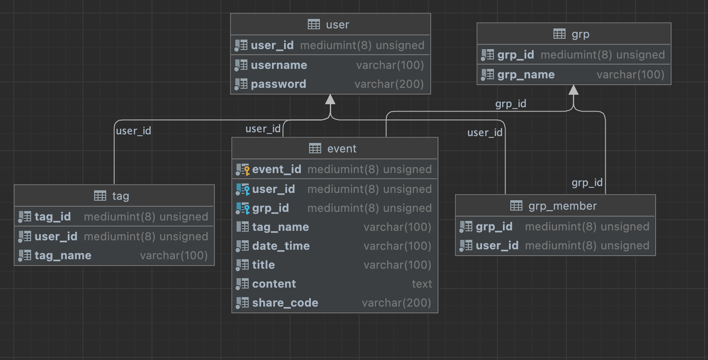

# CSE330/503S

### Creative Part

- Users can tag an event with a particular category and enable/disable those tags in the event list. 
- Users can share their calendar with additional users. Specifically, an unique share code can be created when user click on the share button, and other users can add the shared event by share code. 
- Users can create group events that display on multiple users calendar.
- Users can tag an group with specific group name and change their group in the event list.  
- Users can simultaneously enable/disable the tag and group botton. 

### Database

### Glance

