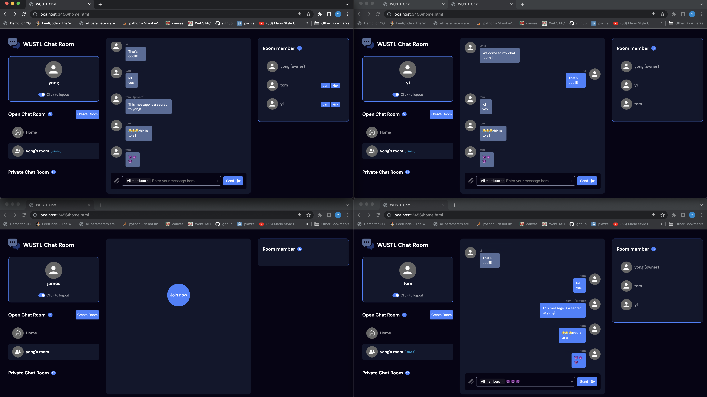

# CSE330/503S

## Some Notes

```
1.  User names and room names should be unique.

2.  Every account is disposable. When logged out or refreshed the page, this user name cannot be used anymore.
    Then you should use another user name.

3.  But all chat histories related to that user are kept.
    
```

## What it is like



* Administration of user created chat rooms (25 Points):
    - [x] Creators of chat rooms can permanently ban users from joining that particular room (2 points)
    - [x] A private room can be created that is password protected (5 points)
    - [x] Creators of chat rooms can temporarily kick others out of the room (3 points)
    - [x] Users can create chat rooms with an arbitrary room name(5 points)
    - [x] The chat room displays all users currently in the room (5 points)
    - [x] Users can join an arbitrary chat room (5 points)
* Messaging (5 Points):
    - [x] Users can send private messages to another user in the same room (4 points)
    - [x] A user's message shows their username and is sent to everyone in the room (1 point)
* Best Practices (5 Points):
    - [x] Code passes HTML validation (2 points)
    - [x] Code is well formatted and easy to read, with proper commenting (2 points)
    - [x] node_modules folder is ignored by version control (1 points)
* Usability (5 Points):
    - [x] Site is visually appealing (1 point)
    - [x] Communicating with others and joining rooms is easy and intuitive (4 points)
* Creative Portion (10 Points)
    - [x] Display all joined rooms
    - [x] Keep chat history
    - [x] When switching rooms, display chat history of that room and automatically scroll to bottom
    - [x] Newly joined members cannot see the chat history before they joined
    - [x] Display the number of all rooms’ members and the number of rooms
    - [x] Simultaneously join different rooms
    - [x] When receiving a message, automatically scroll to the bottom
    - [x] Users can use “Enter” key to send messages and rapidly restore input box

## Grading
40/40 + 10/10
+ -0.5pts: package.json file is not commited
+ +2pts: Site is visually appealing
